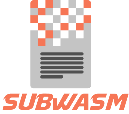

# subwasm

<figure>

</figure>

<figure>

</figure>

## Introduction

The metadata of a given runtime is a critical piece of information as it describes how one can interact with the runtime,
what operations are possible and what are the signatures of the calls.
It contains the exhaustive list of all the features publicly exposed by the runtime.

This tool only works with Substrate-based runtimes which are `>=V11`. For earlier versions, you’ll need to connect to an archive node.

Any node can be queried to provide its current metadata. This can be displayed in json format for instance.
This is a great way to have a peek at what the runtime can do. You may however want to inspect a runtime that was not deployed yet to any node.

**`subwasm`** can work **offline** on wasm files without any node or internet connectivity.

## Capabilities & features

`subwasm` can:

-   get the metadata from a a wasm file directly (no need for a node): command `get`

-   show summary information and version of a runtime: commands `info` and `version`)

-   diff between two runtime to help users spot changes and difference: command `diff`

-   show the list of pallets and their content (calls, events, errors, storage, constants): command `show`

-   analyze 2 runtimes to figure out whether they are compatible and if the `transaction_version` needs to be bumped: command `diff`

-   compress and decompress a runtime WASM: commands `compress` and `decompress`

-   get the latest metadata from a running node: command `get`

-   fetch the latest runtime (wasm) from a running node: command `get`

-   get runtime and metadata at any point of time using a Block hash as reference: command `get`

-   do all of the above with an output for human or as json

## Demos

### Get a runtime

<figure>

<figcaption>subwasm get</figcaption>
</figure>

### info command

<figure>

<figcaption>subwasm info</figcaption>
</figure>

### show command

<figure>

<figcaption>subwasm show</figcaption>
</figure>

### meta command

<figure>

<figcaption>subwasm meta</figcaption>
</figure>

### diff command

<figure>

<figcaption>subwasm diff</figcaption>
</figure>

## Install

### Using Cargo

    cargo install --locked --git https://github.com/chevdor/subwasm --tag v0.16.1

### Homebrew

MacOS Homebrew users can use:

    brew tap chevdor/subwasm https://github.com/chevdor/subwasm
    brew install subwasm

### Linux

    wget https://github.com/chevdor/subwasm/releases/download/v0.16.1/subwasm_linux_amd64_v0.16.1 -O subwasm.deb
    sudo dpkg -i subwasm.deb
    subwasm --help

## Usage

### Command: --help

    `subwasm` allows fetching, parsing and calling some methods on WASM runtimes of Substrate based chains

    Usage: subwasm [OPTIONS] [COMMAND]

    Commands:
      get         Get/Download the runtime wasm from a running node through rpc
      info        The `info` command returns summarized information about a runtime
      version     The `version` command returns summarized information about the versions of a runtime
      metadata    Returns the metadata of the given runtime in several format. You may also use the "meta" alias
      show        Shows the a reduced view of the runtime
      diff        Compare 2 runtimes after converting them to `ReducedRuntime`s
      compress    Compress a given runtime wasm file. You will get an error if you try compressing a runtime that is already compressed
      decompress  Decompress a given runtime wasm file. You may pass a runtime that is already uncompressed
      help        Print this message or the help of the given subcommand(s)

    Options:
      -v, --version   Show the version
      -j, --json      Output as json
      -n, --no-color  [env: NO_COLOR=]
      -q, --quiet     Less output
      -h, --help      Print help

### Command: get

    Get/Download the runtime wasm from a running node through rpc

    Usage: subwasm get [OPTIONS] [RPC_URL]

    Arguments:
      [RPC_URL]
              The node url including (mandatory) the port number. Example: ws://localhost:9944 or http://localhost:9933

    Options:
      -c, --chain <CHAIN>
              Provide the name of a chain or an alias.

              If you pass a valid --chain, --rpc_url will be ignored --chain local = http://localhost:9933

      -b, --block <BLOCK>
              The optional block where to fetch the runtime.

              That allows fetching older runtimes but you will need to connect to archive nodes. Currently, you must pass a block hash. Passing the block numbers is not supported.

      -u, --url <URL>
              Load the wasm from a URL (no node) such as <https://github.com/paritytech/polkadot/releases/download/v0.9.42/polkadot_runtime-v9420.compact.compressed.wasm>

      -g, --github <GITHUB>
              Load the wasm from Github passing a string in the format `<runtime>@<version>` such as `kusama@0.9.42`

      -o, --output <OUTPUT>
              You may specifiy the output filename where the runtime will be saved.

              If not provided, we will figure out an appropriate default name based on a counter: runtime_NNN.wasm where NNN is incrementing to make sure you do not override previous runtime. If you specify an existing file as output, it will be overwritten.

      -j, --json
              Output as json

      -n, --no-color
              [env: NO_COLOR=]

      -q, --quiet
              Less output

      -h, --help
              Print help (see a summary with '-h')

### Command: info

    The `info` command returns summarized information about a runtime

    Usage: subwasm info [OPTIONS] [FILE]

    Arguments:
      [FILE]
              The wasm file to load. It can be a path on your local filesystem such /tmp/runtime.wasm

              You may also fetch the runtime remotely, see `chain` and `url` flags.

    Options:
      -c, --chain <CHAIN>
              Load the wasm from an RPC node url such as http://localhost:9933 or ws://localhost:9944, a node alias such as "polkadot" or "dot",

              NOTE: --chain local = http://localhost:9933

      -b, --block <BLOCK>
              The optional block where to fetch the runtime. That allows fetching older runtimes but you will need to connect to archive nodes. Currently, you must pass a block hash. Passing the block numbers is not supported

      -u, --url <URL>
              Load the wasm from a URL (no node) such as <https://github.com/paritytech/polkadot/releases/download/v0.9.42/polkadot_runtime-v9420.compact.compressed.wasm>

      -g, --github <GITHUB>
              Load the wasm from Github passing a string in the format `<runtime>@<version>` such as `kusama@0.9.42`

      -j, --json
              Output as json

      -n, --no-color
              [env: NO_COLOR=]

      -q, --quiet
              Less output

      -h, --help
              Print help (see a summary with '-h')

By default, the ID for the Parachain pallet is expected to be `0x01` and the call ID for `authorize_upgrade` is expected to be `0x03`.
This default behavior can be overriden by setting the `PARACHAIN_PALLET_ID` to the ID of your parachain pallet and the `AUTHORIZE_UPGRADE_PREFIX` to the ID of your choice.
Also, because of a recent [breaking change to the `parachainSystem::authorizeUpgrade` extrinsic](https://github.com/paritytech/cumulus/commit/3249186fe643f62ca95769e2217f858dde803ab6), a new `checkVersion` boolean flag is required on chains running on Cumulus v0.9.41 and above.
This new behavior is supported by the `AUTHORIZE_UPGRADE_CHECK_VERSION` env variable, which, if set, is evaluated to `true` if its value is the string `"true"`, or false otherwise.
If not set, the behavior remains the same as pre-0.9.41.

### Command: version

    The `version` command returns summarized information about the versions of a runtime

    Usage: subwasm version [OPTIONS] [FILE]

    Arguments:
      [FILE]
              The wasm file to load. It can be a path on your local filesystem such /tmp/runtime.wasm

              You may also fetch the runtime remotely, see `chain` and `url` flags.

    Options:
      -c, --chain <CHAIN>
              Load the wasm from an RPC node url such as http://localhost:9933 or ws://localhost:9944, a node alias such as "polkadot" or "dot",

              NOTE: --chain local = http://localhost:9933

      -b, --block <BLOCK>
              The optional block where to fetch the runtime. That allows fetching older runtimes but you will need to connect to archive nodes. Currently, you must pass a block hash. Passing the block numbers is not supported

      -u, --url <URL>
              Load the wasm from a URL (no node) such as <https://github.com/paritytech/polkadot/releases/download/v0.9.42/polkadot_runtime-v9420.compact.compressed.wasm>

      -g, --github <GITHUB>
              Load the wasm from Github passing a string in the format `<runtime>@<version>` such as `kusama@0.9.42`

      -j, --json
              Output as json

      -n, --no-color
              [env: NO_COLOR=]

      -q, --quiet
              Less output

      -h, --help
              Print help (see a summary with '-h')

### Command: meta

    Returns the metadata of the given runtime in several format. You may also use the "meta" alias.

    If you want to see the content of a runtime, see the `show` sub-command.

    Usage: subwasm metadata [OPTIONS] [FILE]

    Arguments:
      [FILE]
              The wasm file to load. It can be a path on your local filesystem such as /tmp/runtime.wasm or a node url such as http://localhost:9933 or ws://localhost:9944

    Options:
      -c, --chain <CHAIN>
              Provide the name of a chain and a random url amongst a list of known nodes will be used. If you pass a valid --chain, --url will be ignored --chain local = http://localhost:9933

      -u, --url <URL>
              Load the wasm from a URL (no node) such as <https://github.com/paritytech/polkadot/releases/download/v0.9.42/polkadot_runtime-v9420.compact.compressed.wasm>

      -g, --github <GITHUB>
              Load the wasm from Github passing a string in the format `<runtime>@<version>` such as `kusama@0.9.42`

      -b, --block <BLOCK>
              The optional block where to fetch the runtime. That allows fetching older runtimes but you will need to connect to archive nodes. Currently, you must pass a block hash. Passing the block numbers is not supported

      -m, --module <MODULE>
              Without this flag, the metadata command display the list of all modules. Using this flag, you will only see the module of your choice and a few details about it

      -f, --format <FORMAT>
              You may specify the output format. One of "human", "scale", "json", "json+scale", "hex+scale". If you use the default: human, you may want to check out the "show_reduced" command instead

              [default: human]

      -o, --output <OUTPUT>
              You may specifiy the output filename where the metadata will be saved. Alternatively, you may use `auto` and an appropriate name will be generated according to the `format` your chose

      -j, --json
              Output as json

      -n, --no-color
              [env: NO_COLOR=]

      -q, --quiet
              Less output

      -h, --help
              Print help (see a summary with '-h')

### Command: show

    Shows the a reduced view of the runtime.

    A reduced view makes it much easier to understand the inner workings of a given runtime.

    Usage: subwasm show [OPTIONS] [FILE]

    Arguments:
      [FILE]
              The runtimwe to analyze

    Options:
          --chain <CHAIN>
              Provide the name of a chain and a random url amongst a list of known nodes will be used. If you pass a valid --chain, --url will be ignored --chain local = http://localhost:9933

      -b, --block <BLOCK>
              The optional block where to fetch the runtime. That allows fetching older runtimes but you will need to connect to archive nodes. Currently, you must pass a block hash. Passing the block numbers is not supported

      -u, --url <URL>
              Load the wasm from a URL (no node) such as <https://github.com/paritytech/polkadot/releases/download/v0.9.42/polkadot_runtime-v9420.compact.compressed.wasm>

      -g, --github <GITHUB>
              Load the wasm from Github passing a string in the format `<runtime>@<version>` such as `kusama@0.9.42`

      -p, --pallet <PALLET>
              Show only information related to the provided pallet

      -s, --summary
              The runtime is shown as a table, listing all pallets with their IDs, the count of calls, events, errors, constants and storage items

      -j, --json
              Output as json

      -n, --no-color
              [env: NO_COLOR=]

      -q, --quiet
              Less output

      -h, --help
              Print help (see a summary with '-h')

### Command: diff

    Compare 2 runtimes after converting them to `ReducedRuntime`s.

    You must pass exactly 2 runtimes.

    Usage: subwasm diff [OPTIONS] <RUNTIME_1> <RUNTIME_2>

    Arguments:
      <RUNTIME_1>
              Reference runtime

      <RUNTIME_2>
              Second runtime

    Options:
      -j, --json
              Output as json

      -n, --no-color
              [env: NO_COLOR=]

      -q, --quiet
              Less output

      -h, --help
              Print help (see a summary with '-h')

### Command: compress

    Compress a given runtime wasm file. You will get an error if you try compressing a runtime that is already compressed

    Usage: subwasm compress [OPTIONS] <INPUT> <OUTPUT>

    Arguments:
      <INPUT>   The path of uncompressed wasm file to load
      <OUTPUT>  The path of the file where the compressed runtime will be stored

    Options:
      -j, --json      Output as json
      -n, --no-color  [env: NO_COLOR=]
      -q, --quiet     Less output
      -h, --help      Print help

### Command: decompress

    Decompress a given runtime wasm file. You may pass a runtime that is already uncompressed.

    In that case, you will get the same content as output. This is useful if you want to decompress "no matter what" and don't really know whether the input will be compressed or not.

    Usage: subwasm decompress [OPTIONS] <INPUT> <OUTPUT>

    Arguments:
      <INPUT>
              The path of the compressed or uncompressed wasm file to load

      <OUTPUT>
              The path of the file where the uncompressed runtime will be stored

    Options:
      -j, --json
              Output as json

      -n, --no-color
              [env: NO_COLOR=]

      -q, --quiet
              Less output

      -h, --help
              Print help (see a summary with '-h')

### Environment variables

In addition to the command line flags, you can also pass one of the following ENV variables:

    # This is a sample .env file. It is not needed if you
    # are using defaults if you want to use the default defined
    # below.

    # POLKADOT_HTTP=http://localhost:9933
    # POLKADOT_WS=ws://localhost:9944
    # PARACHAIN_PALLET_ID=0x01
    # AUTHORIZE_UPGRADE_PREFIX=0x02

    RUST_LOG=subwasm=debug,substrate_differ=trace

## Sample runs

**Fetch a runtime from a running node**

We will start by fetching the runtime from a node.

Please note that you will likely need to connect to an **archive** node to retrieve an older runtime (`<V11`). A runtime takes around 2MB of storage on-chain and thus, older versions are pruned and will no longer be accessible if you are connecting to a non-archive node.

**Here we get the latest version of the runtime, the 3 commands do the same since they all use the default values:**

    subwasm get
    subwasm get --url http://localhost:9933
    subwasm get --url http://localhost:9933 --output runtime_000.wasm

**Here we get an older runtime, back when Polkadot was at block 20 !**

    subwasm get brew tap chevdor/subwasm --block 0x4d6a0bca208b85d41833a7f35cf73d1ae6974f4bad8ab576e2c3f751d691fe6c

By default, your runtime will be saved as `runtime_000.wasm`. Running this command again will increase the counter so we you don’t lose your previous runtime. You may also use the `--output` flag to provide the destination and filename of your choice. Beware, in this case, there will be no incremented counter.

**Get quick check of a runtime**

    # Show the runtime version and exit with status 0
    subwasm info --input kusama-2030.wasm

    # Provide a few explanations and exit with a status that is not 0
    subwasm info --input tictactoe.wasm

### Metadata JSON and jq tricks

`jq` can be used to reprocess the json output. For instance, removing all the documentation from the metadata makes it significantly smaller. The example below shows how to remove `documentation`, `value` and `default` making it much easier on the eyes for human parsing…​

        subwasm --json meta runtime.wasm | jq 'del( .. | .documentation?, .default?, .value? )'

## Alternatives

Here is a list of other projects allowing to get the raw metadata through a rpc call:

-   [PolkadotJS](https://github.com/polkadot-js/apps) from Jaco / Parity

-   [subsee](https://github.com/ascjones/subsee) from Andrew / Parity

-   [substrate-api-client](https://github.com/scs/substrate-api-client) from SCS

-   [subxt](https://github.com/paritytech/substrate-subxt) from Parity

All those alternatives require a running node and access it via jsonrpc.
